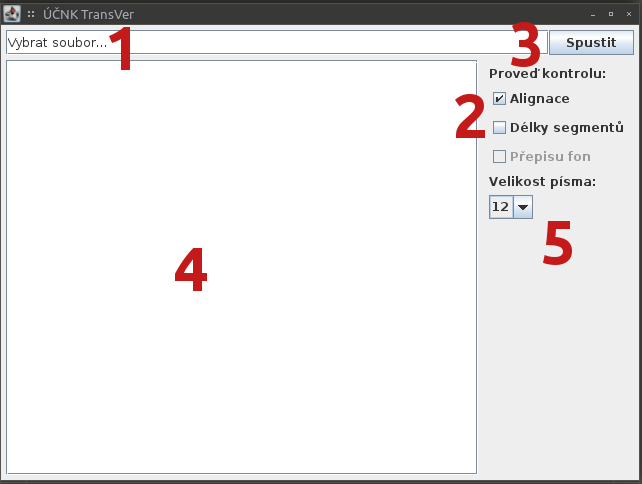

# Úvod

TransVer vám umožňuje zkontrolovat:

1. **Alignaci vrstev ort a fon**, tj. jestli byla při vytváření fonetického
   přepisu do vrstvy fon správně doplněna svislítka `|` a rovnítka `=`; viz
   podrobný návod a postup [zde](./alignace.md). Pokud s pravidly, kterými v
   přepisu stopy fon dosahujeme alignace se stopou ort, ještě nejste seznámeni,
   přečtěte si prosím
   [tento dokument](https://trnka.korpus.cz/mluvka2/wiki/doku.php?id=alignace)
   (dostupný až po přihlášení do databáze Mluvka2).

2. **Délky segmentů na vrstvě ort**, tj. jestli je splněn požadavek maximálně
   25 slov na segment; viz podrobný návod a postup [zde](./delky_segmentu.md).

Pokud si nejste jisti, jak ovládat grafické rozhraní programu, návod naleznete
v následující sekci.

## Jak TransVer používat

Zde si obecně popíšeme způsob práce s programem. Ten vypadá následovně:

1. Nejprve klikněte do pole `Vybrat soubor...` **(1)**; ukáže se vám nabídka, v
   níž vyberete soubor .eaf, který chcete zkontrolovat.
2. Pak pomocí zaškrtávacích políček **(2)** zvolte kontroly, které chcete
   provést (kontrola přepisu fon zatím není dostupná).
3. Klikněte na tlačítko `Spustit` **(3)**.
4. Výstup kontroly alignace (pokud je zvolená) se objeví v rámečku **(4)**;
   výstup kontroly délky segmentů (znovu, pokud je zvolená) se zapíše do nového
   souboru .eaf ve stejné složce, v níž se nachází vámi zadaný zdrojový soubor
   .eaf. Jeho jméno je jiné, aby nedošlo k přepsání zdrojového souboru, a též
   se zobrazí v rámečku **(4)**. Jak s těmito výstupy nejjednodušeji dále
   nakládat se dozvíte v příslušných návodech o [alignaci](./alignace.md) a
   [délkách segmentů](./delky_segmentu.md).
5. Pokud je pro vás písmo v rámečku **(4)** příliš malé, můžete si je
   přizpůsobit pomocí roletky **(5)**.
